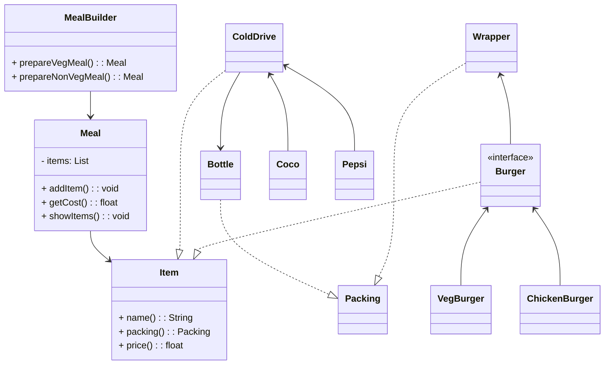

# 建造者设计模式

**创建型设计模式**

> 主要用于将复杂构造的对象分解为多个简单的步骤一步一步地构建。

## 类图

```mermaid
classDiagram

Burger<--VegBurger
Burger<--ChickenBurger

Burger..|>Item
ColdDrive..|>Item

Meal-->Item
MealBuilder-->Meal

Wrapper..|>Packing
Bottle..|>Packing

Wrapper<--Burger
ColdDrive-->Bottle

ColdDrive<--Coco
ColdDrive<--Pepsi

class MealBuilder {
    + prepareVegMeal(): Meal
    + prepareNonVegMeal(): Meal
}

class Meal {
    - items: List<Item>
    + addItem(): void
    + getCost(): float
    + showItems(): void
}

class Item {
    + name(): String
    + packing(): Packing
    + price(): float
}

class Burger {
    <<interface>>
}

class Packing {
    
}

class Wrapper {
    
}

class Bottle {
    
}

class ColdDrive {
    
}

class Pepsi {
    
}

class Coco {
    
}

class VegBurger {
    
}

class ChickenBurger {
    
}


```