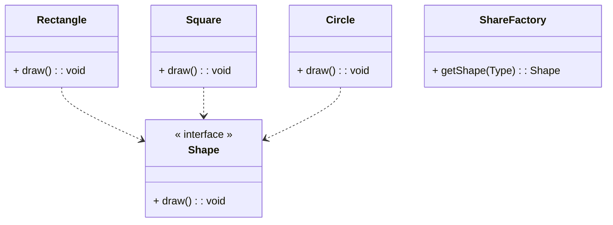

# 工厂模式

**创建型设计模式**

> 定义创建对象的接口，让其子类自己决定实例化哪一个工厂类，工厂模式使其创建过程延迟到子类。

# 说明

1. 优点: 
   1. 使用者想要创建一个对象， 只需要直到其名称即可。
   2. 拓展性高，如需要增加一个产品，只要拓展一个工厂类即可。
   3. 屏蔽具体的实现，使用者只需要关心接口。
2. 缺点
   1. 没增加一个产品时，都需要对应的具体类和对象实现工厂，增加系统复杂性。
3. 使用场景
   1. 日志记录器, 譬如LoggerFactory。
   2. 数据库访问， JdbcTemplateFactory.

## 类图

