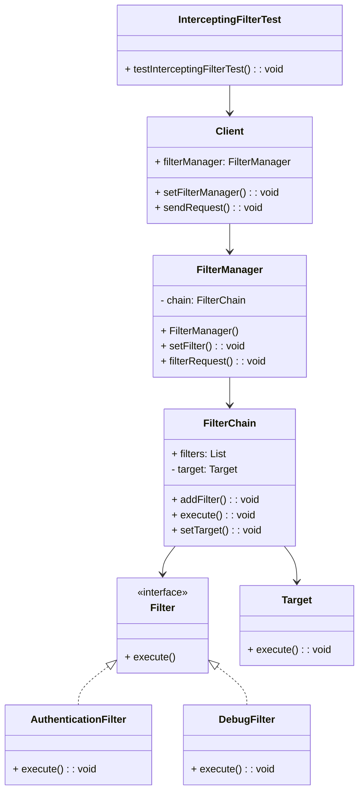

# 拦截过滤器

> 用于对应用程序的请求或响应做一些预处理/后处理。定义过滤器，把请求传给实际目标应用程序之前应用在请求上。  
> 过滤器可以做认证/授权/记录日志，或者跟踪请求，然后把请求传给相应的处理程序。

## 类图

```mermaid
classDiagram
class Filter {
    <<interface>>
    + execute()
}

Filter<|..AuthenticationFilter
class AuthenticationFilter {
    + execute(): void
}

InterceptingFilterTest --> Client
Client --> FilterManager
FilterChain --> Filter
FilterChain --> Target
FilterManager --> FilterChain

Filter<|..DebugFilter
class DebugFilter {
    + execute(): void
}

class InterceptingFilterTest {
    + testInterceptingFilterTest(): void
}

class Client {
    + filterManager: FilterManager
    + setFilterManager(): void
    + sendRequest(): void
}

class FilterManager {
    - chain: FilterChain
    + FilterManager()
    + setFilter(): void
    + filterRequest(): void
}

class FilterChain {
    + filters: List<Filter>
    - target: Target
    + addFilter(): void
    + execute(): void
    + setTarget(): void
}


class Target {
    + execute(): void
}
```

## 案例

参考 Tomcat Filter 设计