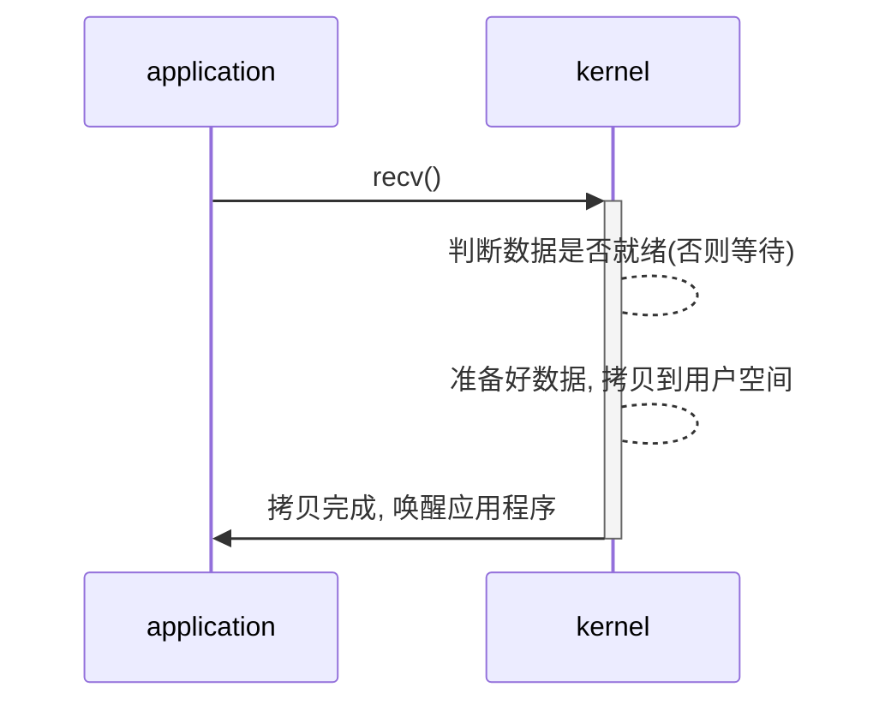

# Block IO model

```txt
最传统的IO模型, 在读写数据的过程中会发生阻塞现象.
当用户线程发出IO请求之后, 内核回去查看数据是否就绪, 如果没有就绪的话就会等待数据就绪, 而用户线程就会处于阻塞状态, 用户线程交出CPU. 当数据就绪之
后, 内核就会将数据拷贝到用户线程,并返回结果给用户线程, 用户线程才会救出block状态.
```

## 时序图



## 思考
1.  通过多线程+阻塞IO来解决效率的问题?  
答: 通过该种模式, 每个socket对应一个线程, 容易造成很大的资源占用; 特别是长连接来说, 线程资源一致不会释放. 