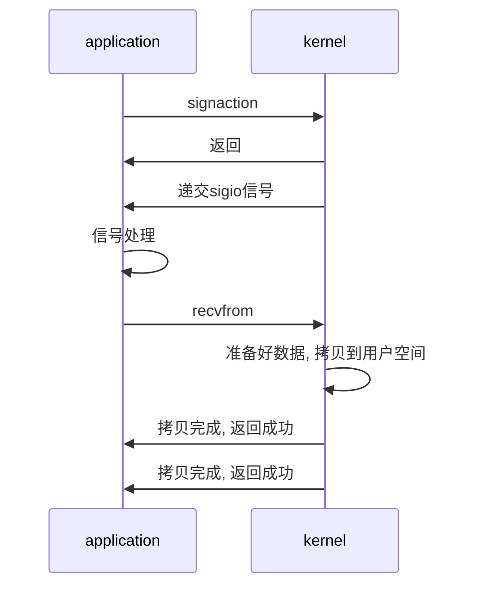

# 信号驱动UI模型

```txt
在信号驱动IO模型中，当用户线程发起一个IO请求操作，会给对应的socket注册一个信号函数，然后用户线程会继续执行，当内核数据就绪时会发送一个信
号给用户线程，用户线程接收到信号之后，便在信号函数中调用IO读写操作来进行实际的IO请求操作。这个一般用于UDP中，对TCP套接口几乎是没用的，原
因是该信号产生得过于频繁，并且该信号的出现并没有告诉我们发生了什么事情
```

## 时序图

