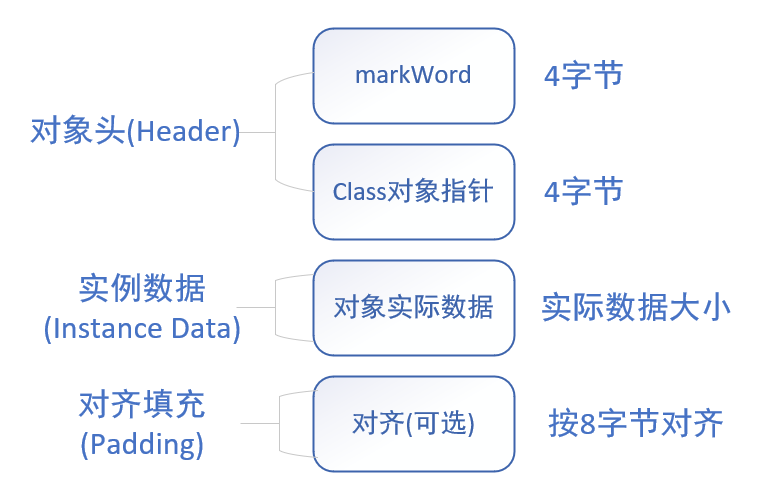
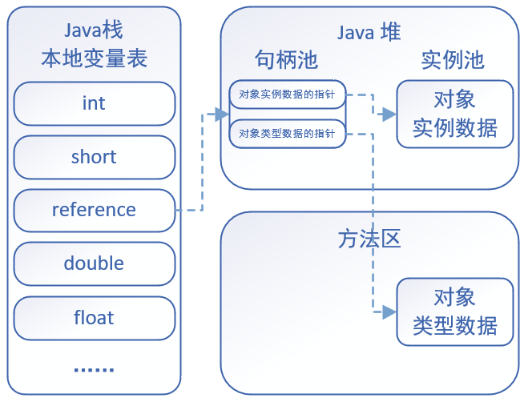
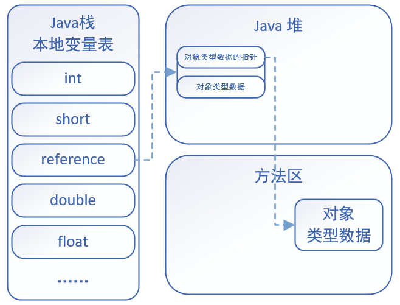

# HotSpot 虚拟机对象

## 对象的内存布局
在HotSpot虚拟机中, 对象的内存布局为一下3块区域. 
1. 对象头(Header).
2. 实例对象(Instance Data).
3. 对齐填充(Padding).

### 对象头
对象头记录了对象在运行过程中所需要使用的一些数据:
1. 哈希码
2. GC分代年龄
3. 锁状态标志
4. 线程持有的锁
5. 偏向线程ID
6. 偏向时间戳

对象头可能包含类型指针, 通过该指针能确定对象属于哪个类. 如果对象是一个数组, 那么对象头还会包括数组长度. 

### 实例数据
示例数据部分就是成员变量的值, 其中包括父类成员变量和本类成员变量. 

### 对其填充
用于确保对象的总长度为8字节的整数倍.  
HotSpot VM 的自动内存管理系统要求对象的大小必须时8字节的整数倍. 而对象头部分正好是8字节的倍数(1倍或者2倍), 因此, 当对象实例数据部分没有对齐
时, 就需要通过对齐填充来补全. 
`对齐填充并不是必须依然存在, 也没有特别的含义, 它仅仅起着占位符的作用.`

## 对象的创建过程
### 类加载检查
虚拟机在`.class`文件时, 若遇到一条new指令, 首先它会去检查常量池中是否有这个类的符号引用, 并且检查这个符号引用所代表的类是否已被加载, 解析
和初始化. 如果没有, 那么必须先执行相应的类加载过程. 

### 为新生对象分配内存
对象所需内存的大小在类加载后便完全确定, 接下来从堆中划分一块对应大小的内存空间给新的对象. 分配堆中内存有俩种方式: 
1. `指针碰撞`: 如果Java`堆中内存绝对规整`(说明采用的时`复制算法`或`标记整理法`), 空闲内存和已使用内存中间放着一个指针作为分界点指示器, 那么
分配内存时只需要把指针向空闲内存挪动一段与大小一样的距离, 这种分配方式称为`指针碰撞`. 
2. `空闲列表`: 如果Java`堆中内存并不规整`, 已使用的内存和空闲内存交错(说明采用的时`标记-清除法`, 有碎片), 此时没法简单进行指针碰撞, VM必须
维护一个列表, 记录其中那些内存块空闲可用. 分配之时从空闲列表中找到一块足够大的内存空间划分给对象实例. 这种方式称为`空闲列表`.

### 初始化
分配完内存后, 为对象中的成员变量赋上初始值, 设置对象头信息, 调用对象的构造函数方法进行初始化.  
至此, 整个对象的创建过程就完成了. 

## 对象的访问方式
所有对象的存储空间都是在堆中分配的, 但是这个对象的引用却是在堆栈中分配的. 也就是说在建立一个对象时俩个地方都分配内存, 在堆中分配的内存只是一个
指向这个堆对象的指针(引用)而已. 那么根据引用存放的地址类型不同, 对象也有不同的访问方式.

### 句柄式访问方式
堆中需要有一块叫做`句柄池`的内存空间, 句柄中包含了对象实例数据与类型数据各自的具体地址信息.  
引用类型的变量存放的就是该对象的句柄地址(reference). 访问对象时, 首先需要通过引用类型的变量找到该对象的句柄, 然后根据句柄中对象的地址找到对象. 

### 直接指针访问方式
引用类型的变量直接存放对象的地址, 从而不需要句柄池, 通过引用能直接访问对象. 但对象所在的内存空间需要额外的策略存储对象的类信息的地址.

需要说明的时, HotSpot 采用的时第二种方式, 即`直接指针访问方式`. 只需要一次寻址操作, 所以性能上比句柄式访问方式快一倍. 但向上面所说的, 他需要
额外的策略来存储对象在方法区中类信息的地址. 