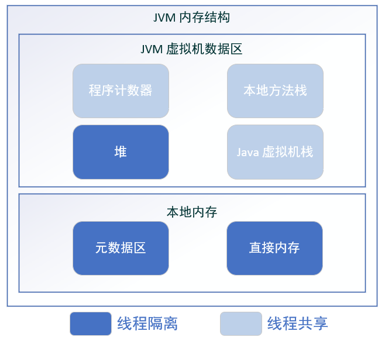

# JVM 内存结构

## 概览

1. Java 虚拟机的内存结构主要分为以下 5 个部分
   1. 程序计数器  
   2. Java 虚拟机栈
   3. 本地方法栈
   4. 堆
   5. 方法区  

2. JDK 7 和 JDK 8 对比, 最大的区别就是: 元数据区取代了永久代. 元数据空间的本质和永久代类似, 都是对JVM规范中方法区的实现. 
不过元数据空间与永久代之间最大的区别就是: 元数据空间并不在虚拟机中, 而是使用本地内存.

## 程序计数器

### 定义
程序计数器是一块比较小的内存空间，是当前线程正在执行的那条字节码指令的地址。若当前线程正在执行的是一个本地方法, 
那么此时的程序计数器为 `Undefined`.

### 作用
1. 字节码解释器通过改变程序计数器来依次读取指令, 从而实现代码的流程控制
2. 在多线程情况下, 程序计数器记录的是当前线程执行的位置, 而当线程切换回来的时候, 就知道上次线程执行到哪里了.

### 特点
1. 较小的内存空间
2. 线程私有, 每条线程都有自己的程序计数器. 
3. 生命周期: 随着线程的创建而创建, 随着线程的结束而销毁. 
4. 唯一一个不会出现 `OutOfMemoryError` 的内存区域. 

## Java 虚拟机栈(Java 栈)

### 定义
1. Java虚拟机栈是描述Java方法运行过程的内存模型.
2. Java虚拟机栈会为每一个即将运行的Java方法创建一块叫做`栈帧`的区域, 用于存放该方法运行中的一些信息, 比如:
   1. 局部变量表
   2. 操作数栈
   3. 动态链接
   4. 方法出口信息
   5. ...

### 压栈出栈过程

1. 当方法区运行过程中需要创建局部变量时, 就将局部变量存入栈中的局部变量表中.   
2. Java虚拟机栈的栈顶是当前正在执行的活动栈, 也就是当前正在执行的方法, PC寄存器也会指向这个地址. 只有这个活动的栈帧的本地变量可以被操作
数栈使用, 当在这个栈帧中调用另一个方法, 与之对应的栈帧又会被创建, 新创建的栈帧压入栈顶, 变为当前的活动栈帧. 
3. 方法调用结束后, 当前栈帧被移出, 栈帧的返回值变成新的活动栈帧中操作数栈的一个操作数. 如果没有返回值, 那么新的活动栈帧中操作数栈的操作
数没有变化. 
`由于Java虚拟机栈与线程对应, 数据不是线程共享的(线程私有), 因此不用关心数据一致性问题, 也不会存在同步锁的问题`

### 局部变量表

1. 定义为一个数字数组, 主要用于存储方法参数、定义在方法体内部的局部变量, 数据类型包括各类基本数据类型, 对象引用, 以及 return address 类型
2. 局部变量表容量大小实在编译期确定下来的. 最基本的存储单元时 slot, 32 位占用一个 slot, 64 位类型(long、double)占用俩个 slot.
3. 对于slot的理解: 
   1. JVM 虚拟机会为局部变量表中的每个slot都分配一个访问索引, 通过这个索引即可成功访问到局部变量表中指定的局部变量值.
   2. 如果当前帧是由构造函数或者实例方法创建的, 那么该对象引用this, 会存放在 index 为 0 的 slot 处, 其余的参数表顺序继续排列. 
   3. 栈帧中的局部变量表中的槽位是可以重复的, 如果一个局部变量过了起作用域, 那么其作用域之后申明的新的局部变量则有可能复用过期局部变量
   表的槽位, 从而达到节省资源的目的.

### 操作数栈

1. 栈顶缓存技术: 由于操作数是存储在内存中, 频繁地进行内存读写影响执行速度, 将栈顶元素全部缓存到物理CPU的寄存器中，以此降低对内存的读写次数,
提升执行引擎的执行效率. 
2. 每一个操作数栈会拥有一个明确的栈深度, 用于存储数值, 最大深度在编译期就定义好了. 32bit 类型占用一个栈单位深度, 64bit 类型占用俩个栈单位深度操作数栈.
3. 并非采用访问索引方式进行数据访问, 而只能通过标准的入栈、出栈操作完成一次数据访问. 

### 方法的调用

1. 静态链接: 当一个字节码文件被装载进JVM内部时, 如果被调用的目标方法在编译器可知, 且运行时期间保持不变, 这种情况下调用方的符号引用转为直接
引用的过程叫做静态链接. 
2. 动态链接: 如果被调用的方法无法在编译期被确定下来, 只能在运行期将调用的方法的符号引用转为直接引用, 这种引用具备动态性, 故称为动态链接. 
3. 方法绑定
   1. 早期绑定: 被调用的目标方法如果在编译器可知, 且运行期保持不变. 
   2. 晚期绑定: 被调用的方法在编译期无法被确定, 只能在程序运行期根据实际的类型绑定相关的方法. 
4. 非虚方法: 如果方法在编译期就确定了具体的调用版本, 则这个版本在运行时是不可变的. 这样的方法成为非虚方法, 静态方法、私有方法、 final 方法、 
实例构造器、父类方法都是非虚方法, 出了这些以外都是虚方法. 
5. 虚方法表: 面向对象的变成中, 会很频繁的使用动态分配, 如果每次动态分配的过程都要重新在类的方法元数据中搜索适合的目标的话, 就可能影响到
执行效率, 因此为了提高性能, JVM 采用在类的方法区中建立一个虚方法表, 使用索引表来替代查找. 
   1. 每个类都有一个虚方法表, 表中存放着各个方法的实际入口. 
   2. 虚方法表会在类加载的链接阶段被创建, 并开始初始化, 类的变量初始值准备完成之后, JVM 会把该类的方法页初始化完毕.
6. 方法重写的本质
   1. 找到操作数栈顶的第一个元素所执行的对象的实际类型, 记作 C. 如果在类型C中找到与常量池中描述符和简单名称都相符的方法, 则进行访问权限检验.
   2. 如果通过则返回这个方法的直接引用, 查找过程结束; 不通过则返回 `IllegalAccessError` 异常. 
   3. 否则, 按照继承关系从下往上依次对C的各个父类进行上一步搜索和验证数据过程. 
   4. 如果始终没有找到合适的方法, 则抛出 `AbstractMethodError` 异常. 

~~~
Java中任何一个普通方法都具备虚函数的特征(运行期确认, 具备晚期绑定的特点), C++中则使用关键字vitual来显示定义, 如果在Java程序中, 不希望
某个方法拥有虚函数的特征, 则可以使用final 类标记这个方法. 
~~~

### Java 虚拟机的特点
1. 运行速度特别快, 仅仅次于PC寄存器. 
2. 局部变量表随着栈帧的创建而创建, 他的大小在编译时确定, 创建时只需要分配实现规定的大小即可. 在方法运行过程中, 局部变量表的带线啊哦是不会发生变化的.
3. Java虚拟机栈中会出现俩种异常: `StackOverFlowError` 和 `OutOfMemoryError`. 
   1. StackOverFlowError: 若Java虚拟机栈的大小不允许动态扩展, 那么当前线程请求的深度超过Java虚拟机允许的最大深度时, 抛出该异常. 出现该异常时并不代表内存消耗完了.  
   2. OutOfMemoryError: 若允许动态拓展, 那么当前线程请求栈时的内存用完了, 无法再动态扩展时, 抛出该异常. 
4. Java 虚拟机栈也是线程私有, 随着线程创建而创建, 随着线程的结束而销毁. 
5. 常见的运行时异常: 
   1. `NullPointerException` -> 空指针引用异常
   2. `ClassCastException` -> 类型强转换异常
   3. `IllegalArgumentException` -> 传参异常
   4. `ArithmeticException` -> 算数运算异常
   5. `ArrayStoreException` -> 向数组存放与类型不相兼容的对象异常
   6. `IndexOutOfBoundsException` -> 下标越界异常
   7. `NegativeArraySizeException` -> 创建大小为负数的数组异常
   8. `NumberFormatException` -> 数字格式异常
   9. `SecurityException` -> 安全异常
   10. `UnsupportedOperationException` -> 不支持操作异常

### 本地方法栈(C栈)

#### 定义
本地方法栈为Jvm运行native方法准备的空间, 由于很多Native方法都是C语言实现的, 所以他通常叫做C栈. 他与Java虚拟机栈实现的功能类似, 只不过
本地方法栈时描述本地方法运行过程中的内存模型. 

#### 栈帧变化过程
本地方法被执行时, 在本地方法栈也会创建一块栈帧, 用于存放该本地方法的局部变量表、操作数栈、动态链接、方法出口信息等...  
方法执行结束后, 相应的栈帧也会出栈, 并释放内存空间. 也会抛出StackOverFlowError和OutOfMemoryError异常/
~~~
如果Java虚拟机本身不支持native方法, 或者本身不依赖与传统栈, 那么可以不提供本地方法栈. 如果支持本地方法栈, 那么这个栈一般都会在线程
创建的时候按线程分配. 
~~~

### 堆 (Heap)

#### 定义
堆是用来存放对象的内存空间, 几乎所有的对象都存储在堆中. 

#### 特点

1. 线程共享, 整个Java虚拟机只有一个堆, 所有的线程都访问同一个堆. 而程序计数器、Java虚拟机栈、本地方法栈都是一个线程对应一个. 
2. 在虚拟机启动的时候创建. 
3. 是垃圾回收的主要场所.
4. 堆主要是由新生代(Eden区、From Survivor、To Survivor)、 老年代
5. Java虚拟机规定, 堆可以处于物理上不连续的内存空间中, 但在逻辑上他应该被视为连续的. 
6. 关于Survivor s0、s1区: 复制之后有交换, 谁空着谁就是 s0.

~~~
不同的区域存放不同生命周期的对象, 这样可以根据不同的区域使用不同的垃圾回收算法, 更加具备针对性.   
堆的大小既可以固定也可以拓展, 但对于主流的虚拟机, 堆的大小是可拓展的, 因此当线程请求分配内存, 但堆已满, 且内存无法再扩展的时候, 就抛出 OutOfMemoryError.
Java堆所使用的内存不需要保证是连续的. 而由于堆是被所有线程共享的, 所以对它的访问需要注意同步问题, 方法和对应的属性都需要保持一致性.
~~~

#### 新生代和老年代
1. 老年代比新生代生命周期长. 
2. 新生代与老年代空间默认比例是 1:2, Jvm 调参数, XX:NewRatio=2, 表示新生代占1, 老年代占2.
3. Hotspot中, Eden空间和另外俩个Survivor空间缺省所占比例是: 8:1:1. 
4. 几乎所有的Java对象都是在Eden区被new出来的, Eden放不了的大对象, 就直接进入老年代了. 

#### 对象分配过程
1. new 的对象先放在Eden区, 大小有限制.
2. 如果创建新对象时, Eden空间填满了, 就会触发 Minor GC, 将Eden不再被其他对象引用的对象进行销毁, 再加载新的对象放到Eden区, 特别注意的是
Survivor区满了是不会出发Minor GC的, 而是Eden区填满了, Minor GC 才顺便清理Survivor区
3. 将Eden中剩余的对象移动到Survivor 0 区
4. 再次触发垃圾回收, 此时上次 Survivor 下来的, 放在 Survivor 0 区的, 如果没有回收, 就会被再放到 Survivor 1 区.
5. 再次经历垃圾回收, 又会将幸存者重新放回 Survivor 0 区, 以此类推.
6. 默认是15次的循环, 超过了15次, 则会将幸存者下来的转去老年区. Jvm 参数设置次数: -XX:MaxTenuringThreshold=N 进行设置
7. 频繁再新生区收集, 很少在老年区收集, 几乎不在永久区/元空间收集

#### Full GC/ Major GC 出发条件
1. 显性调用 System.gc(), 老年代的空间不够, 方法区的空间不够等都会触发 Full GC, 同时对新生代和老年代回收, Full GC 的 STW 的时间最长, 应该要避免.
2. 在出现 Major GC 之前, 会先出发 Minor GC, 如果老年代的空间不够就会触发 Major GC, STW 的时间长于 Minor GC.

#### 逃逸分析
##### 标量替换
1. 标量不可再分解的量, Java的基本数据类型就是标量, 标量对应就是可以被进一步分解的量, 而这种量称之为标量. 而在Java中对象可以再一步分解的
则成为聚合两. 
2. 替换过程, 通过逃逸分析确定该对象不会被外部访问, 并且对象可以被再一步分解时, Java不会创建该对象, 而会将该对象变量分解若干个被这个方法
使用的成员变量所替代. 这些替代的成员变量在栈帧或寄存器上分配空间.

##### 对象和数组并非在堆上分配内存的
1. 随着JIT编译器的发展与逃逸分析技术逐渐成熟, `栈上分配`、`标量替换`优化技术将会导致一些变化, 所有的对象都分配到堆上也渐渐不变
得那么绝对了. 
2. 这是一种可以有效减少Java内存堆分配压力的分析算法, 逃过逃逸分析, Java Hotspot编译器能分析出一个新的对象的引用的使用范围从而决定是否
要将这个对象分配到堆上. 
3. 当一个对象在方法中被定义后, 他可能被外部方法所引用, 如作为调用参数传递到其他地方, 成为`方法逃逸`.
4. 再入赋值给类变量或可以在其他线程中访问的实例变量, 成为`线程逃逸`.
5. 使用逃逸分析, 编译器可以对代码做出一下的优化: 
   1. 同步省略: 如果一个对象被发现只能从一个线程中被访问到, 那么对于这个对象的操作可以不考虑同步. 
   2. 将堆分配转换为栈分配: 如果一个对象在子程序中被分配, 要使指向该对象的指针永远不会逃逸, 对象可能是栈分配的候选, 而不是堆分配. 
   3. 分离对象或者变量替换: 有的对象可能不需要做为一个连续的内存结构存在也可以被访问到, 那么对象的部分(或全部)可以不存储在内存中, 而是
   存储在CPU寄存器中. 
6. 在编译期, 如果JIT经过逃逸分析, 发现有些对象没有逃逸出方法, 那么有可能堆内存分配会被优化为栈内存分配. 
7. Jvm参数设置, -XX:+DoEscapeAnalysis: 开启逃逸分析, -XX: -DoEscapeAnalysis: 关闭逃逸分析. 
8. Jdk 1.7 开始已经默认开启逃逸分析. 

#### TLAB
1. TLAB 的全程是 Thread Local Allocation Buffer, 即线程本地分配缓存区, 是属于Eden区的, 这是一个线程专用的内存分配区域, 线程私有, 
默认开启的(不是绝对的,看使用的哪个类型的虚拟机)
2. 堆是全局共享的, 在同一时间, 可能会有多个线程在堆上申请空间, 但每次的对象分配需要同步的进行(虚拟机采用CAS配上失败重试的方式保证更新操作
的原子性)但是效率却有点下降.
3. 所以用TLAB来避免多线程冲突, 在给对象分配内存时, 每个线程使用自己的TLAB, 这样可以是的线程同步, 提高了对象分配的效率. 
4. 当然并不是所有的对象都可以在TLAB中分配内存成功, 如果分配失败就会使用加锁的机制来确保操作的原子性. 
5. -XX:+UseTLA: 使用TLAB, -XX:+TLABSize设置TLAB大小. 

#### 四种引用方式
1. 强引用: 创建一个对象并把这个对象赋给一个引用变量, 普通new出来的对象的变量引用都是强引用, 有强引用变量指向时永远不会被垃圾回收, Jvm即使
抛出OOM, 可以将引用赋值为null, 那么它所指向的对象就会被垃圾回收. 
   1. 日常定义的类即为强引用. 
   2. 取消强引用: 设置为null, 例如`ArrayList`的clear方法, 就是将所有的元素设置为null以此及时释放内存资源. 
2. 软引用: 如果一个对象具有软引用, 内存空间足够, 垃圾回收就不会回收它; 如果内存空间不足了, 就会回收他们. 
   1. 使用 `SoftReference` 类可以将对象设置为软引用.
   2. 使用场景: 例如图片缓存框架中, 可以将目标图片设置为软引用, 这样子在内存不足的时候可以及时释放这一块的资源, 从而保证服务稳定. 
3. 弱引用: 非必须对象, 当Jvm进行垃圾回收时, 无论内存是否充足, 都会回收被弱引用关联的对象. 
   1. 使用 `WeakReference` 类可以将对象设置为软引用.
   2. 使用场景: 案例->一个类发送网络请求, 承担callback的静态内部类, 则常以虚引用的方式来保存外部类的引用, 当外部类需要被Jvm回收的时, 就
   不会因为网络请求没有即使回应, 引起内存泄露.
4. 虚引用: 虚引用并不会决定对象的生命周期, 如果一个对象仅持有虚引用, 那么他就和没有任何引用一样, 在任何时候都可能被回收期回收. 使用 
`PhantomReference` 类将对象设置为虚引用. 
   1. 需要结合`PhantomReference`和`ReferenceQueue`进行使用.
   2. 使用场景: 用于跟踪对象被垃圾回收的活动, 一般可以通过虚引用达到回收一些非Java内的一些资源, 如对外内存. 如 `DirectByteBuffer` 使用
   PhantomReference 的子类 Cleaner, 在创建的时候会添加一个Runnable 实例, 用于当 DirectByteBuffer 对象不可达时回收堆外资源. 

### 方法区
#### 定义
Java 虚拟机规范中定义方法区是堆的一个逻辑部分. 方法区主要存放一下信息:
1. 已经被虚拟机加载的类信息
2. 常量
3. 静态变量
4. 即时编译器编译后的代码

#### 方法区的特点
1. 线程共享. 方法区是堆的一个逻辑部分, 因此和堆一样, 都是线程共享的. 整个虚拟机中只有一个方法区. 
2. 永久代. 方法区中的信息一般需要长期存在, 而且他又是堆的逻辑分区, 因此用堆的划分方法, 把方法区成为`永久代`.
3. 内存回收效率低. 方法区中的信息一般需要长期存在, 回收一遍之后可能只有少量信息无效. 主要回收的目标是: 对常量池的回收; 对类型的卸载.
4. Java虚拟机规范对方法区的要求比较宽松. 和堆一样, 允许固定大小, 也允许动态扩展, 还允许不实现垃圾回收. 

#### 运行时常量池
当类被Java虚拟机加载后, .class 文件中的常量就存放在方法区的运行时常量池中. 而且在运行期间, 可以向常量池中添加新的常量. 如String类的intern()
方法就能在运行期间向常量池中添加字符串常量. 

#### 直接内存(堆外内存)
直接内存是除Java虚拟机之外的内存, 但也坑能被Java使用. 

##### 直接操作内存
在NIO中引入了一种基于通道和缓冲的IO方法. 它可以通过调用本地方法直接分配Java虚拟机之外的内存, 然后通过一个存储在堆中的`DirectByteBuffer`对象
直接操作该内存, 而无须先将外部内存中的数据复制到堆中在进行操作, 从而提高了数据操作的效率. 
直接内存的大小不受Java虚拟机控制, 但既然是内存, 当内存不足时就会抛出`OutOfMemoryError`异常. 

##### 直接内存与堆内存比较
1. 直接内存申请空间耗费更高的性能. 
2. 直接内存读取IO的性能要优于普通的堆内存.
3. 直接内存作用链: 本地IO -> 直接内存 -> 本地IO
4. 堆内存作用链: 本地IO -> 直接内存 -> 非直接内存 -> 直接内存 -> 本地IO

*服务器管理员在配置虚拟机参数时, 会根据实际内存设置-Xmx 等参数信息, 但经常忽略直接内存, 使得各个内存区域总和大于物理内存限制, 从而导致动态拓展时出现*`OutOfMemoryError`*异常*.

